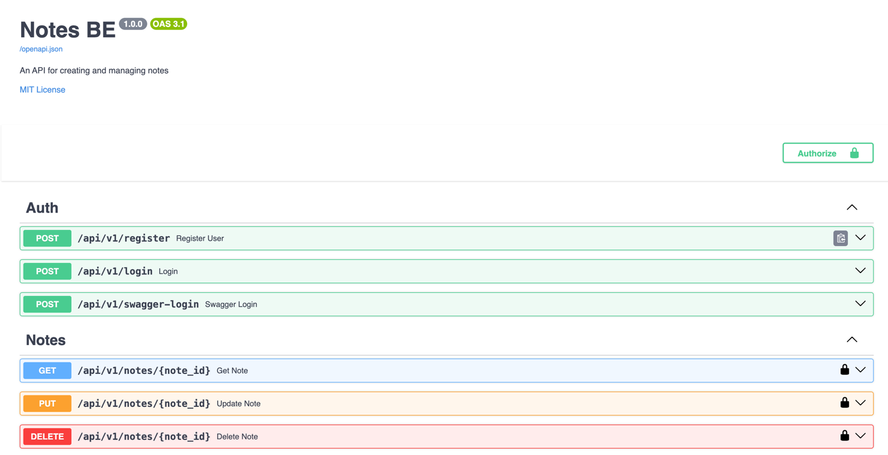

# Notes BE

Personal Be for notes-app

[Notes Webapp](https://albertobarrago.github.io/)



## Feature Description
- Python v3.12
- FastApi BE with JWT authentication
- Mysql, SQLAlchemy and Alembic
- Swagger (automagically) on `/docs`

## Test 
```shell
pytest -p no:warnings test/**/*.py
```

## TODO
 - [x] Add Logger
 - [x] Improve Error Handling
 - [x] Audit action notes and auth 
 - [x] Check import
 - [x] Add home API for Welcome localhost:/ 


## Note for alembic 
 - `alembic init alembic`
 - Import Base and all Models inside `env.py`
 - `alembic revision --autogenerate -m "Create tables from scratch"`
 - `alembic upgrade head`

## Tree

```tree
app/
├── __init__.py
├── api
│   ├── __init__.py
│   └── v1
│       ├── __init__.py
│       └── endpoints
│           ├── __init__.py
│           ├── auth.py
│           ├── home.py
│           └── note.py
├── core
│   ├── __init__.py
│   ├── access_token.py
│   └── config.py
├── db
│   ├── __init__.py
│   └── models
│       ├── __init__.py
│       ├── audit.py
│       ├── base.py
│       ├── notes.py
│       └── users.py
├── main.py
├── schemas
│   ├── __init__.py
│   ├── auth.py
│   ├── note.py
│   └── user.py
└── utils
    ├── __init__.py
    ├── audit
    │   ├── __init__.py
    │   └── actions.py
    ├── auth
    │   ├── __init__.py
    │   └── actions.py
    ├── db
    │   ├── __init__.py
    │   ├── actions.py
    │   └── mysql.py
    └── note
        ├── __init__.py
        └── actions.py

```


Please if you don't find some requirements, or have some problem during installing steps; Send me a PM. I really appreciate ♥️  
